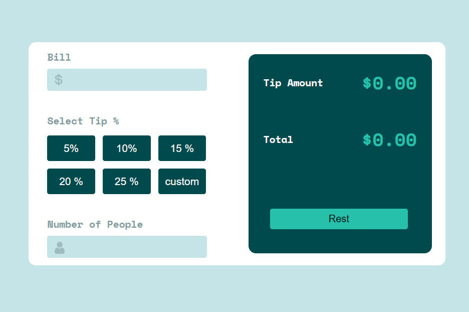
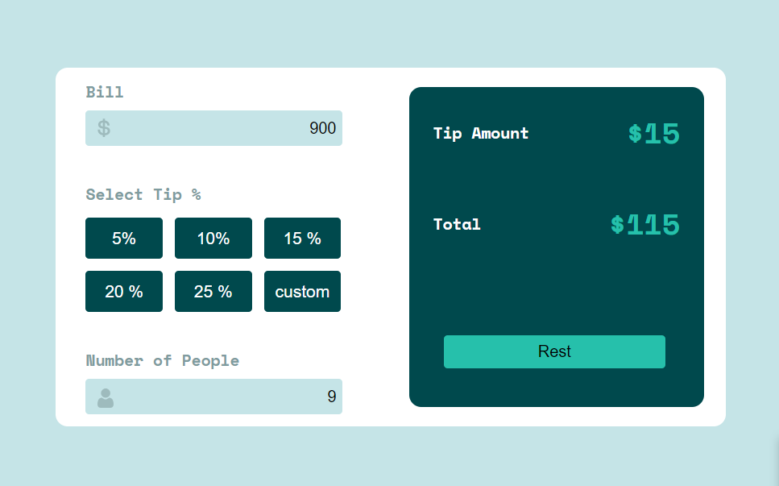

# tip-calculator
# tip-calculator Frontend Design using HTML CSS & JavaScript

Welcome to the tip-calculator repository! This is a fully responsive and interactive tip calculator, meticulously crafted with HTML, CSS, and JavaScript to provide a seamless user experience. 

## Overview

In this project, I have designed an attractive and responsive frontend layout for a sneakers website. The design is mobile-friendly and adapts seamlessly to various screen sizes, making it accessible to users on desktops, tablets, and smartphones.

## How to Use

To experience the frontend design, you can follow these steps:

1. Clone the Repository: Clone this repository to your local machine using the following command:

```bash
https://github.com/haseebtahir-dev/tip-calculator.git
```

2. Open index.html: Navigate to the project directory and open the index.html file in your preferred web browser. You will be able to explore the complete frontend design.

## Contributions
I would always welcome contributions to enhance the design further. If you have any suggestions, bug fixes, or new features to add, feel free to create a pull request. Please ensure that your contributions align with the project's goals and adhere to best practices.

## Credits
This frontend design was created with great efforts drawing inspiration from Bootstrap's amazing features and design principles.

## License
The "tip-calculator" repository is open-source and licensed under the GNU License. You are free to use, modify, and distribute the code as per the terms of the license.




